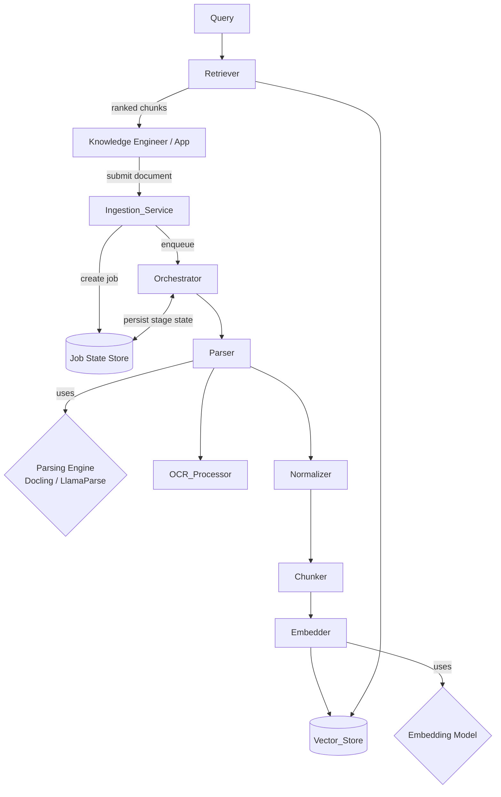
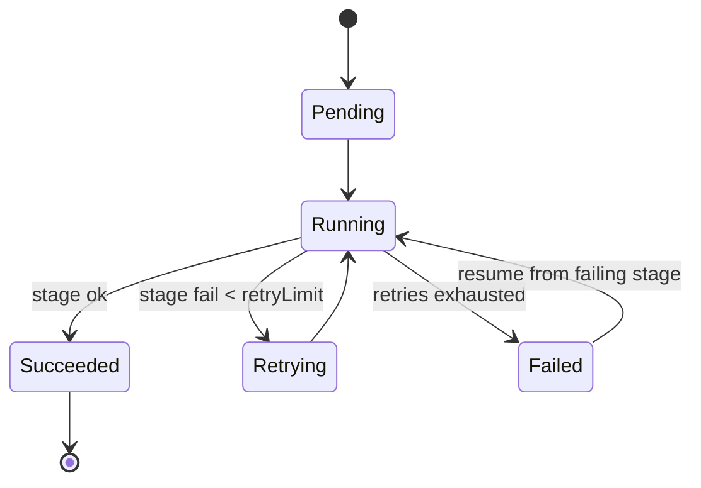

# Design Document

## Overview

This document describes the technical design for an end-to-end Retrieval-Augmented Generation (RAG) pipeline specialized for biomedical engineering content. The pipeline transforms heterogeneous biomedical source documents (EBooks, research papers, articles, journals in PDF/EPUB/DOCX/HTML) into a queryable vector Knowledge_Library and serves the most relevant Chunks as grounded context to downstream LLMs.

The system is organized as a set of discrete, composable stages coordinated by an Orchestrator:

```
Ingestion → Parsing → (Table/Figure Extraction + OCR) → Normalization → Chunking → Embedding → Vector Storage → Retrieval
```

The design emphasizes three cross-cutting concerns derived directly from the requirements:

1. **Pluggability** — The Parsing_Engine (Docling, LlamaParse), the embedding model/dimension, and the Vector_Store are all selected through configuration behind stable interfaces (Req 2.2, 7.3, 8.x). No business logic depends on a concrete backend.
2. **Bounded, observable, resumable execution** — Every stage has explicit bounds (file size, timeouts, retry limits) and the Orchestrator persists per-stage state so that failed jobs resume from the failing stage rather than restarting (Req 10).
3. **Verifiable correctness of content transformations** — The two content-preserving transformations that are most error-prone (normalization serialization and chunking) are specified as universally-quantified correctness properties and validated with property-based testing (Req 5.6, Req 6.5).

### Requirements Coverage Map

| Requirement | Primary Design Element |
|-------------|------------------------|
| 1. Document Ingestion | `Ingestion_Service`, `ProcessingJob`, content-hash dedup, validation gate |
| 2. Advanced Document Parsing | `Parser` + pluggable `ParsingEngine` (Docling/LlamaParse adapters) |
| 3. Table and Figure Extraction | `Parser` table/figure extraction → `Table`, `Figure` models |
| 4. Scanned Image and OCR Processing | `OCRProcessor`, per-page/per-image OCR with confidence + timeouts |
| 5. Formatting Artifact Normalization | `Normalizer`, `NormalizedDocument`, serialization round-trip |
| 6. Content Chunking | `Chunker`, `Chunk`, completeness invariant |
| 7. Embedding Generation | `Embedder` + pluggable `EmbeddingModel`, retry policy |
| 8. Vector Storage and Knowledge Library | `VectorStore` interface + adapters, atomic reprocess/replace |
| 9. Retrieval for LLM Ingestion | `Retriever`, similarity ranking, filters, validation |
| 10. Orchestration and Observability | `Orchestrator`, `JobStateStore`, stage transitions, resume |

## Architecture

### High-Level Architecture



### Stage Pipeline and Data Flow

The Orchestrator drives a strictly sequential stage pipeline per Processing_Job (Req 10.1). Each stage consumes the artifact produced by the previous stage and produces a new persisted artifact:


| Stage | Input artifact | Output artifact | Persisted for resume? |
|-------|----------------|-----------------|------------------------|
| Parsing | Source_Document bytes | Parsed_Document | Yes |
| Normalization | Parsed_Document | Normalized_Document | Yes |
| Chunking | Normalized_Document | Chunk set | Yes |
| Embedding | Chunk set | Embedding set | Yes (per-chunk) |
| Storage | Embedding set | Vector_Store records | Terminal |

OCR and Table/Figure Extraction are sub-activities of the Parsing stage; they enrich the Parsed_Document and do not constitute independent resumable stages. The five resumable stages are **parsing, normalization, chunking, embedding, storage** (Req 10.1, 10.4).

### Architectural Principles

- **Hexagonal / ports-and-adapters.** Each pluggable backend (parsing engine, embedding model, vector store) is defined as a port (interface). Concrete adapters (DoclingAdapter, LlamaParseAdapter, etc.) implement the port. Stage logic depends only on ports, satisfying the configurability requirements (Req 2.2, 7.3) and pluggable vector store requirement.
- **Idempotent, content-addressed ingestion.** Documents are deduplicated by content hash (Req 1.5), making re-submission safe.
- **Stage isolation.** A stage reads only the previous stage's persisted artifact, so a resumed job can re-enter at any stage with the upstream artifacts intact (Req 10.3, 10.4).
- **Fail-closed transformations.** Parsing and normalization retain no partial output on failure (Req 2.5, 5.8); storage replacement is atomic (Req 8.4).

### Configuration Model

A single validated `PipelineConfig` holds all bounded parameters. Bounds are enforced at construction time so out-of-range values are rejected before any job runs.

| Config key | Type | Bounds | Default | Requirement |
|------------|------|--------|---------|-------------|
| `maxFileSizeBytes` | int | 1 .. 524,288,000 | 524,288,000 | 1.2, 1.6 |
| `maxFilenameLength` | int | fixed 255 | 255 | 1.8 |
| `parsingEngine` | enum | {docling, llamaparse} | docling | 2.2 |
| `parseTimeoutSeconds` | int | > 0 | 300 | 2.7 |
| `ocrConfidenceThreshold` | float | 0.0 .. 1.0 | 0.70 | 4.4 |
| `ocrPageTimeoutSeconds` | int | > 0 | 60 | 4.6 |
| `maxChunkTokens` | int | 128 .. 2048 | 512 | 6.1 |
| `chunkOverlapTokens` | int | 0 .. maxChunkTokens-1 | 64 | 6.2 |
| `embeddingModel` | string | registered model id | (none) | 7.3, 7.4 |
| `embeddingDimension` | int | 64 .. 4096 | 1536 | 7.1, 7.5 |
| `embeddingTimeoutSeconds` | int | > 0 | 10 | 7.2 |
| `embeddingMaxRetries` | int | fixed 3 | 3 | 7.6, 7.7 |
| `vectorStoreBackend` | enum | {pgvector, qdrant, ...} | pgvector | 8.x |
| `defaultTopK` | int | 1 .. 100 | 5 | 9.1, 9.3 |
| `maxQueryChars` | int | fixed 4000 | 4000 | 9.2 |
| `stageRetryLimit` | int | 0 .. 10 | 3 | 10.2 |

## Components and Interfaces

Interfaces below are expressed in language-neutral pseudosignatures. The implementation language is left to the tasks phase; the contracts are what matter.

### 1. Ingestion_Service (Req 1)

```
interface IngestionService:
    submit(file: FileInput) -> IngestionResult
    # FileInput = { filename, declaredFormat, bytes }
    # IngestionResult = Accepted(jobId) | Duplicate(existingJobId) | Rejected(errorCode, message)
```

Validation gate, applied in order, each producing a distinct rejection (Req 1.3, 1.6, 1.7, 1.8):
1. Filename present and ≤ 255 chars (1.8).
2. Byte size ≥ 1 and ≤ 500 MB (1.2, 1.6, 1.7 empty case).
3. Format ∈ {PDF, EPUB, DOCX, HTML} by content sniffing, not just extension (1.3).
4. File is a complete, well-formed instance of its declared format (1.7 corruption check).
5. Content hash (SHA-256) computed; if it matches an existing job, return existing jobId (1.5).

On success: create `ProcessingJob`, assign a UUID job identifier guaranteed unique (1.1), record metadata `{filename, format, byteSize, contentHash, submittedAtUtc}` (1.4), return within 5 s (1.1). The unique identifier and the dedup index live in the Job State Store.

### 2. Parser and Parsing Engine (Req 2, 3)

```
interface ParsingEngine:           # the pluggable port (Req 2.2)
    isAvailable() -> bool
    parse(doc: SourceDocument, deadline) -> RawParseResult
    engineId() -> string

class Parser:
    parse(job, config) -> ParsedDocument        # throws ParseFailure
```

The `Parser` selects the configured `ParsingEngine` (DoclingAdapter or LlamaParseAdapter) from a registry. Responsibilities:
- Produce text blocks in reading-sequence order with structural metadata (block type, position) (2.1).
- Multi-column ordering: top-to-bottom within a column, left-to-right across columns (2.3).
- Preserve heading hierarchy with nesting levels (2.4).
- Extract tables (every non-empty cell mapped to exactly one (row,col); spanning cells assigned top-left with span counts) (3.1, 3.2).
- Extract figures with captions; record caption-absent without failing (3.3, 3.4).
- Associate each table/figure with source page number and zero-based reading-order position (3.5).
- Degraded table extraction: retain raw region text and flag failed structured extraction (3.6).

Failure handling (fail-closed, no partial output retained):
- Engine unavailable → mark job failed, record engine id (2.6).
- Parse error → mark failed, record reason, discard partial output (2.5).
- Parse exceeds `parseTimeoutSeconds` (300 s default) → failed with timeout reason (2.7).
- No extractable text → failed with no-extractable-content reason (2.8).

### 3. OCR_Processor (Req 4)

```
interface OCRProcessor:
    processPage(pageImage, deadline) -> OCRResult        # OCRResult = { text, confidence } | OCRError | OCRTimeout
    processEmbeddedImage(image, deadline) -> OCRResult
```

Invoked by the Parser for any page lacking an extractable text layer (4.1) and for embedded images containing text (4.2). Each OCR text block carries a confidence score in [0.0, 1.0] (4.3). Blocks below `ocrConfidenceThreshold` (default 0.70) are flagged low-confidence but retained (4.4). OCR failures (unreadable/corrupt/unsupported image) record a per-image error indication and processing continues for remaining pages/images (4.5). Per-page OCR exceeding `ocrPageTimeoutSeconds` (60 s) aborts that page with a timeout indication and continues (4.6). OCR is resilient (best-effort) and never aborts the whole parse for a single image.

### 4. Normalizer (Req 5)

```
class Normalizer:
    normalize(parsed: ParsedDocument) -> NormalizationResult
    # NormalizationResult = Normalized(NormalizedDocument) | Empty(reason) | Malformed(error)

    serialize(doc: NormalizedDocument) -> bytes
    deserialize(data: bytes) -> NormalizedDocument
```

Responsibilities:
- Remove header/footer elements recurring on ≥ 2 pages, including page numbers (5.1).
- De-hyphenate line-break-split words when the joined token is a known dictionary word (5.2); retain intrinsic (mid-line) hyphens unchanged (5.3).
- Produce a canonical representation preserving all source content: heading hierarchy, tables, figures, OCR text (5.4), with page number and reading-order position per element (5.5).
- Empty/no-content input → empty normalized representation + "no content" indication (5.7).
- Malformed input → reject, leave prior valid output unchanged, return malformed indication (5.8).

The `serialize`/`deserialize` pair underpins the round-trip property (5.6) and is the durable persisted form used by the Orchestrator for resume.

A configurable dictionary (biomedical-aware word list) backs the de-hyphenation decision. It is injected so tests can supply a deterministic dictionary.

### 5. Chunker (Req 6)

```
class Chunker:
    chunk(doc: NormalizedDocument, config) -> list<Chunk>
```

Responsibilities:
- Token-bounded chunks ≤ `maxChunkTokens` (128..2048) (6.1).
- Configured overlap between consecutive chunks in [0, maxChunkTokens-1] (6.2).
- Attach `{documentId, pageNumber, headingPath}` metadata; empty values when page/heading unavailable but always include documentId (6.3, 6.7).
- Keep a table in a single chunk when it fits (6.4); split across chunks each within bound when it doesn't (6.6).
- Completeness: ordered concatenation of chunk contents with overlap removed contains all non-artifact text (6.5).
- No non-artifact text → zero chunks (6.8).

Token counting uses a pluggable tokenizer consistent with the embedding model family; it is injected for deterministic testing.

### 6. Embedder and Embedding Model (Req 7)

```
interface EmbeddingModel:          # pluggable port (Req 7.3)
    modelId() -> string
    dimension() -> int
    embed(text, deadline) -> vector

class Embedder:
    embed(chunk, config) -> EmbedResult     # EmbedResult = Embedding | EmbedFailed(cause)
```

- Output dimension equals configured dimension (64..4096) and is identical across all chunks for a given model (7.1, 7.5).
- Produce embedding within `embeddingTimeoutSeconds` (10 s) (7.2).
- Model selection by config; missing/unrecognized model → reject with error identifying invalid config, chunk left unmodified (7.3, 7.4).
- On failure, retain chunk and retry up to 3 attempts (7.6); after 3 failed attempts mark chunk failed, retain original content (7.7).

### 7. Vector_Store (Req 8)

```
interface VectorStore:             # pluggable port
    upsertBatch(documentId, records: list<VectorRecord>) -> StoreResult
    replaceDocument(documentId, records) -> StoreResult   # atomic swap (Req 8.4)
    deleteDocument(documentId) -> DeleteResult            # not-found error if absent (Req 8.8)
    query(embedding, topK, filter) -> list<ScoredRecord>
```

- Persist embedding + chunk content + complete metadata within 5 s of generation (8.1).
- Every embedding associated with and retrievable by source document identifier (8.2).
- Reprocess replaces prior chunks only after new chunks stored successfully; otherwise retain prior chunks (8.4) — implemented as a transactional/versioned swap.
- Document removal deletes all chunks/embeddings for the id (8.5); removal of unknown id returns not-found error (8.8).
- Persistence failure retains previously stored chunks and returns an error (8.6).
- Adapters: pgvector (default), Qdrant, etc. All implement the same port (pluggable vector store).

### 8. Retriever (Req 9)

```
class Retriever:
    retrieve(query: QueryRequest) -> RetrievalResult
    # QueryRequest = { text, topK?, filter? }
```

- Return top-K most similar chunks (default 5, range 1..100) with similarity scores in [0.0, 1.0] within 2 s (9.1).
- Reject empty or > 4000-char query text, return no chunks, invalid status (9.2).
- Reject out-of-range topK (<1 or >100) (9.3).
- Include source metadata (documentId, pageNumber) per chunk (9.4); placeholder when missing (9.5).
- Empty library → empty result + "library empty" status (9.6).
- Metadata filter restricts results (9.7); filter matching nothing → empty result + "no match" status (9.8).
- Order by descending similarity; ties broken by ascending documentId (9.9).

### 9. Orchestrator (Req 10)

```
class Orchestrator:
    run(jobId) -> JobOutcome
    resume(jobId) -> JobOutcome | Rejected(notResumable)
    status(jobId) -> JobStatus    # { currentStage, stageStatuses, progressPercent }
```

- Execute parsing → normalization → chunking → embedding → storage sequentially, each starting only after the prior succeeds (10.1).
- On stage failure, retry up to `stageRetryLimit` (0..10, default 3) (10.2).
- After exhausting retries, mark job failed, record failing stage id, preserve outputs of completed stages (10.3).
- Resume restarts from the recorded failing stage, reusing preserved upstream outputs (10.4).
- Resume on a job with no recorded failing stage → reject with not-resumable error (10.5).
- Record stage id, status (pending|running|succeeded|failed), and transition timestamp on every transition (10.6).
- Expose current stage id and integer progress percent 0..100 while running (10.7).



## Data Models

### Core Identifiers and Enums

```
JobId        = UUID (unique across all jobs, Req 1.1)
DocumentId   = stable id derived from content hash
Stage        = enum { PARSING, NORMALIZATION, CHUNKING, EMBEDDING, STORAGE }
StageStatus  = enum { PENDING, RUNNING, SUCCEEDED, FAILED }
Format       = enum { PDF, EPUB, DOCX, HTML }
```

### ProcessingJob (Req 1, 10)

```
ProcessingJob:
    jobId: JobId
    documentId: DocumentId
    metadata: DocumentMetadata
    currentStage: Stage
    stageStates: map<Stage, StageState>
    failingStage: Stage | null        # set when failed (Req 10.3); drives resume (10.4, 10.5)
    progressPercent: int [0..100]      # Req 10.7
    overallStatus: enum { QUEUED, RUNNING, COMPLETED, FAILED }

DocumentMetadata:                      # Req 1.4
    filename: string (1..255)
    format: Format
    byteSize: int (1..524,288,000)
    contentHash: string                # SHA-256, dedup key (Req 1.5)
    submittedAtUtc: timestamp

StageState:                            # Req 10.6
    stage: Stage
    status: StageStatus
    attempts: int
    lastTransitionAt: timestamp
    failureReason: string | null
    artifactRef: string | null         # pointer to persisted stage output (resume)
```

### ParsedDocument (Req 2, 3, 4)

```
ParsedDocument:
    documentId: DocumentId
    blocks: list<TextBlock>            # reading-order sequence (Req 2.1, 2.3)
    tables: list<Table>
    figures: list<Figure>
    headings: list<Heading>            # hierarchy (Req 2.4)

TextBlock:
    type: enum { PARAGRAPH, HEADING, CAPTION, OCR_TEXT, ... }
    text: string
    pageNumber: int
    readingOrderPosition: int          # zero-based (Req 3.5)
    source: enum { TEXT_LAYER, OCR }
    ocrConfidence: float [0.0..1.0] | null   # Req 4.3
    lowConfidence: bool                # Req 4.4
    headingLevel: int | null           # Req 2.4

Table:                                 # Req 3.1, 3.2, 3.6
    pageNumber: int
    readingOrderPosition: int
    cells: list<Cell>
    degraded: bool                     # Req 3.6
    rawText: string | null             # retained when degraded

Cell:
    rowIndex: int
    colIndex: int
    rowSpan: int (>=1)                 # Req 3.2
    colSpan: int (>=1)                 # Req 3.2
    value: string

Figure:                                # Req 3.3, 3.4
    pageNumber: int
    readingOrderPosition: int
    caption: string | null             # null = caption absent (Req 3.4)
    imageRef: string

Heading:
    level: int
    text: string
    pageNumber: int
    readingOrderPosition: int

ImageOCRError:                         # Req 4.5, 4.6
    imageRef: string
    pageNumber: int
    kind: enum { UNREADABLE, CORRUPT, UNSUPPORTED, TIMEOUT }
```

### NormalizedDocument (Req 5)

```
NormalizedDocument:
    documentId: DocumentId
    elements: list<ContentElement>     # canonical, content-preserving (Req 5.4)

ContentElement:                        # carries page + reading order (Req 5.5)
    kind: enum { TEXT, HEADING, TABLE, FIGURE }
    pageNumber: int
    readingOrderPosition: int
    headingPath: list<string>          # ancestry for TEXT/HEADING
    payload: TextPayload | TablePayload | FigurePayload
```

`NormalizedDocument` is the unit that is serialized/deserialized for the round-trip property (Req 5.6). Equivalence is defined structurally: identical content elements, identical heading hierarchy, identical table/figure structures, and identical page-number and reading-order metadata for every element.

### Chunk and Embedding (Req 6, 7, 8)

```
Chunk:
    chunkId: UUID
    documentId: DocumentId             # always present (Req 6.3, 6.7)
    pageNumber: int | empty            # empty when unavailable (Req 6.7)
    headingPath: list<string> | empty
    content: string
    tokenCount: int (<= maxChunkTokens)  # Req 6.1
    orderIndex: int                    # position in document chunk sequence
    overlapTokenCount: int             # tokens shared with previous chunk (Req 6.2, 6.5)
    isTablePart: bool                  # Req 6.4, 6.6

Embedding:
    chunkId: UUID
    vector: float[dimension]           # dimension in 64..4096 (Req 7.1, 7.5)
    modelId: string
    status: enum { OK, FAILED }        # Req 7.7
    attempts: int                      # Req 7.6

VectorRecord:                          # stored unit (Req 8.1, 8.2)
    documentId: DocumentId
    chunk: Chunk
    embedding: Embedding

ScoredRecord:                          # retrieval result (Req 9)
    record: VectorRecord
    similarity: float [0.0..1.0]
```

The `overlapTokenCount` field is essential to the completeness property (Req 6.5): it makes "overlap removed" an unambiguous operation — reconstruction concatenates chunk contents in `orderIndex` order while dropping the leading `overlapTokenCount` tokens of each chunk after the first.


## Correctness Properties

*A property is a characteristic or behavior that should hold true across all valid executions of a system — essentially, a formal statement about what the system should do. Properties serve as the bridge between human-readable specifications and machine-verifiable correctness guarantees.*

The properties below are derived from the prework analysis of every acceptance criterion. Redundant criteria have been consolidated so each property carries unique validation value. The two properties explicitly mandated by the requirements — the normalization round-trip (Req 5.6) and chunk completeness (Req 6.5) — are anchors of this section.

### Property 1: Job identifier uniqueness

*For any* sequence of distinct document submissions, every Processing_Job created by the Ingestion_Service is assigned a job identifier that is distinct from all other assigned job identifiers.

**Validates: Requirements 1.1**

### Property 2: Ingestion validation is total and bound-correct

*For any* submission, the Ingestion_Service accepts it if and only if the filename length is in [1, 255], the byte size is in [1, 524,288,000], and the format is one of {PDF, EPUB, DOCX, HTML} and well-formed; otherwise it is rejected with the corresponding error and no Processing_Job is created.

**Validates: Requirements 1.2, 1.3, 1.6, 1.7, 1.8**

### Property 3: Content-hash deduplication is idempotent

*For any* document, submitting a byte-identical document a second time returns the originally assigned job identifier and creates no new Processing_Job, while recorded metadata for an accepted submission equals the values derived from its input.

**Validates: Requirements 1.4, 1.5**

### Property 4: Reading-order positions are a contiguous zero-based sequence

*For any* Parsed_Document, the reading-order positions assigned to its content elements form a contiguous sequence of integers starting at zero, and multi-column layouts are ordered top-to-bottom within a column and left-to-right across columns.

**Validates: Requirements 2.1, 2.3, 3.5**

### Property 5: Heading hierarchy is preserved

*For any* Source_Document containing section headings, the heading nesting levels in the Parsed_Document structural metadata are identical to those of the source heading structure.

**Validates: Requirements 2.4**

### Property 6: Table cell coordinates are a collision-free assignment

*For any* extracted (non-degraded) table, every non-empty source cell is assigned to exactly one (rowIndex, colIndex) pair with no two non-empty cells sharing the same coordinate, and any spanning cell's value is placed at its top-left index with its spanned row count and column count recorded.

**Validates: Requirements 3.1, 3.2**

### Property 7: OCR confidence is bounded and the low-confidence flag is correct

*For any* OCR-extracted text block with confidence c and configured threshold t, the confidence c lies in [0.0, 1.0], the block is flagged low-confidence exactly when c < t, and the extracted text is retained regardless of the flag.

**Validates: Requirements 4.3, 4.4**

### Property 8: OCR is resilient to bad images

*For any* document whose pages and embedded images include an arbitrary mix of readable and unreadable/corrupt/unsupported images, every readable item produces stored recovered text and every unreadable item produces a recorded error indication, with no item causing the remaining items to be skipped.

**Validates: Requirements 4.1, 4.2, 4.5**

### Property 9: Normalization removes recurring header/footer artifacts

*For any* Parsed_Document in which a text element recurs in the header or footer region on two or more pages (including page numbers), the normalized representation contains no occurrence of that recurring element.

**Validates: Requirements 5.1**

### Property 10: Line-break de-hyphenation respects the dictionary

*For any* token split across a line break by a trailing hyphen whose joined form is a known dictionary word, the Normalizer outputs the single joined token without the hyphen; and *for any* intrinsic (mid-line) hyphen, the original token is retained unchanged.

**Validates: Requirements 5.2, 5.3**

### Property 11: Normalization preserves all non-artifact content and structure

*For any* Parsed_Document, every non-artifact content element of the source (text, heading hierarchy, tables, figures, OCR-derived text) appears in the normalized representation with its structure intact.

**Validates: Requirements 5.4**

### Property 12: Normalized representation serialization round-trip (REQUIRED)

*For any* NormalizedDocument, deserializing the result of serializing it produces a NormalizedDocument equivalent to the original, where equivalence means identical content elements, identical heading hierarchy, identical table and figure structures, and identical page-number and reading-order metadata for every element.

**Validates: Requirements 5.6, 5.5**

### Property 13: Chunk token bound is never exceeded

*For any* NormalizedDocument and any valid configuration, every produced Chunk — including chunks produced by splitting an oversized table — has a token count that does not exceed the configured maximum chunk size.

**Validates: Requirements 6.1, 6.6**

### Property 14: Configured overlap is honored

*For any* valid configuration with overlap o in [0, maxChunkTokens − 1], each pair of consecutive Chunks shares exactly the configured overlap (bounded by the smaller chunk), recorded in each chunk's overlap token count.

**Validates: Requirements 6.2**

### Property 15: Chunk metadata is always attached

*For any* produced Chunk, the document identifier is present; the page number and heading path are attached when available and set to an empty value when unavailable.

**Validates: Requirements 6.3, 6.7**

### Property 16: Fitting tables stay within a single chunk

*For any* normalized representation containing a table whose content fits within the configured maximum chunk size, the table content is contained entirely within a single Chunk.

**Validates: Requirements 6.4**

### Property 17: Chunk completeness (REQUIRED)

*For any* NormalizedDocument, concatenating the contents of the produced Chunks in order with the per-chunk overlap removed yields text containing all non-artifact text of the normalized representation; and when the normalized representation contains no non-artifact text, zero Chunks are produced.

**Validates: Requirements 6.5, 6.8**

### Property 18: Embedding dimension is consistent and configured

*For any* set of Chunks embedded with a given configured model, every produced Embedding has a dimension equal to the configured dimension (an integer in [64, 4096]).

**Validates: Requirements 7.1, 7.5**

### Property 19: Stored embeddings are retrievable by document identifier

*For any* set of VectorRecords stored for a document identifier, querying the Vector_Store by that identifier returns exactly the records stored under it (no more, no fewer).

**Validates: Requirements 8.2**

### Property 20: Reprocess replacement is atomic

*For any* reprocessing of a document, the previously stored Chunks are replaced only after the newly generated Chunks are stored successfully; if the new storage does not complete, the previously stored Chunks remain unchanged.

**Validates: Requirements 8.4**

### Property 21: Document removal is complete

*For any* document with stored records, removing it deletes all Chunks and Embeddings associated with its source document identifier, leaving none retrievable by that identifier.

**Validates: Requirements 8.5**

### Property 22: Retrieval cardinality and score range

*For any* non-empty Knowledge_Library and valid Query with requested count K, the Retriever returns at most K Chunks, each with a similarity score in [0.0, 1.0].

**Validates: Requirements 9.1**

### Property 23: Returned chunks satisfy the metadata filter

*For any* Query supplied with a metadata filter, every returned Chunk satisfies the filter predicate; if no Chunk satisfies the filter, the result set is empty.

**Validates: Requirements 9.7, 9.8**

### Property 24: Returned chunks always carry source metadata

*For any* returned Chunk, the result includes a document identifier and page number, using a placeholder value when the underlying metadata is unavailable.

**Validates: Requirements 9.4, 9.5**

### Property 25: Result ordering is by descending similarity with deterministic tie-break

*For any* retrieval result set, results are ordered by non-increasing similarity score, and Chunks with equal similarity scores are ordered by ascending document identifier.

**Validates: Requirements 9.9**

### Property 26: Stage execution is strictly sequential

*For any* Processing_Job, the recorded stage transitions show that each stage begins only after its immediately preceding stage has reached the succeeded status, in the order parsing → normalization → chunking → embedding → storage.

**Validates: Requirements 10.1**

### Property 27: Retry attempts are bounded by the configured limit

*For any* stage that fails with configured retry limit L (in [0, 10]), the number of execution attempts for that stage does not exceed L + 1.

**Validates: Requirements 10.2**

### Property 28: Failure preserves completed-stage outputs and enables correct resume

*For any* Processing_Job that fails at a stage S after exhausting retries, the failing stage S is recorded, the persisted outputs of all stages completed before S remain intact, and resuming the job restarts execution at S without re-executing any stage before S.

**Validates: Requirements 10.3, 10.4**

### Property 29: Every stage transition is fully recorded

*For any* Processing_Job, each stage transition produces a record containing the stage identifier, a stage status in {pending, running, succeeded, failed}, and a transition timestamp.

**Validates: Requirements 10.6**

### Property 30: Progress is bounded and monotonic

*For any* running Processing_Job, the exposed completion progress is an integer in [0, 100] and never decreases as the job advances through stages.

**Validates: Requirements 10.7**

## Error Handling

Error handling follows a layered, fail-closed strategy. Each error class has a defined disposition, persistence consequence, and observability outcome.

### Error Categories and Dispositions

| Category | Examples | Disposition | Persistence consequence |
|----------|----------|-------------|--------------------------|
| **Ingestion validation** | unsupported format, oversize, empty/corrupt, bad filename, duplicate | Reject at gate; no job created (duplicate returns existing job id) | None (Req 1.3, 1.5, 1.6, 1.7, 1.8) |
| **Parse failure** | engine error, no extractable text | Mark job failed, record reason, discard partial output | No Parsed_Document retained (Req 2.5, 2.8) |
| **Engine unavailable** | Docling/LlamaParse down | Mark job failed, record engine id | None (Req 2.6) |
| **Parse timeout** | > 300 s | Mark job failed with timeout reason | None (Req 2.7) |
| **Table degraded** | un-structurable table | Continue; flag degraded, retain raw text | Degraded item recorded (Req 3.6) |
| **OCR image error** | unreadable/corrupt/unsupported image | Record per-image error, continue | Error indication in Parsed_Document (Req 4.5) |
| **OCR page timeout** | > 60 s for a page | Abort page, record timeout, continue | Timeout indication (Req 4.6) |
| **Normalization empty** | no content | Return empty normalized doc + indication | Empty output (Req 5.7) |
| **Normalization malformed** | uninterpretable structure | Reject, leave prior output unchanged, error | Prior output preserved (Req 5.8) |
| **Embedding failure** | model/transient error | Retain chunk, retry up to 3; then mark chunk failed, retain content | Chunk content preserved (Req 7.6, 7.7) |
| **Model misconfiguration** | missing/unrecognized model | Reject request, identify invalid config, chunk unmodified | None (Req 7.4) |
| **Storage failure** | persistence error / partial chunk failure | Retain prior chunks, return error; if subset fails, mark job failed and report unstored chunk ids | Prior chunks retained (Req 8.6, 8.7) |
| **Removal of unknown id** | delete non-existent doc | Return not-found error | None (Req 8.8) |
| **Query validation** | empty / > 4000 chars / topK out of range | Reject, return no chunks, invalid/out-of-range status | None (Req 9.2, 9.3) |
| **Empty library / no filter match** | nothing to return | Empty result + status | None (Req 9.6, 9.8) |
| **Stage retry exhaustion** | repeated stage failure | Mark job failed, record failing stage, preserve completed outputs | Completed-stage outputs preserved (Req 10.3) |
| **Non-resumable resume** | no recorded failing stage | Reject with not-resumable error | None (Req 10.5) |

### Cross-Cutting Error Principles

- **Fail-closed transformations.** Parsing and normalization never persist partial or ambiguous output (Req 2.5, 5.8).
- **Resilient sub-stages.** OCR and table extraction degrade gracefully per item rather than failing the whole document (Req 3.6, 4.5, 4.6).
- **Atomic storage.** Reprocessing uses a transactional/versioned swap so the library is never left in a partially-replaced state (Req 8.4, 8.6).
- **Bounded retries with preserved state.** Stage retries are capped (Req 10.2) and completed-stage artifacts persist to enable resume (Req 10.3, 10.4).
- **Structured failure reasons.** Every failure records a machine-readable reason code plus the failing stage, surfaced through the observability API (Req 10.6).

## Testing Strategy

The pipeline contains substantial pure transformation logic (parsing normalization, normalization, chunking, serialization, ranking) with universal properties, so **property-based testing (PBT) applies** and is the primary correctness mechanism for those layers. Infrastructure boundaries (vector store backends, external parsing/OCR/embedding services) are validated with integration and example tests using mocks/adapters.

### Dual Testing Approach

- **Property-based tests** verify the 30 universally-quantified correctness properties above across randomized inputs. They target the pure logic: validation gate, reading-order resolution, table extraction mapping, OCR confidence logic, normalization (incl. round-trip), chunking (incl. completeness), embedding dimension consistency, retrieval ranking/filtering, and orchestration ordering/bounds.
- **Unit (example) tests** cover specific scenarios, configuration selection, and concrete error messages: engine selection (Req 2.2), timeouts (Req 2.7, 4.6, 7.2), model misconfiguration (Req 7.4), specific rejection messages (Req 1.x, 9.2, 9.3), and figure caption presence/absence (Req 3.3, 3.4).
- **Integration tests** (1–3 representative examples each) validate boundaries that do not vary meaningfully with input: vector store persistence/latency (Req 8.1), engine availability detection (Req 2.6), and end-to-end job completion (Req 8.3).

### Property-Based Testing Requirements

- Use an established PBT library for the chosen implementation language (for example, Hypothesis for Python, fast-check for TypeScript, jqwik for Java). PBT is **not** implemented from scratch.
- Each property-based test runs a **minimum of 100 iterations**.
- Each property test is tagged with a comment referencing its design property, using the format:
  `Feature: biomedical-rag-pipeline, Property {number}: {property_text}`
- Each correctness property (Properties 1–30) is implemented by a **single** property-based test.
- Custom generators are required for: `SourceDocument` submissions (format × size × filename boundaries), synthetic engine outputs (multi-column layouts, heading trees), `Table` models (including spanning and oversized cells), OCR result sets (mixed confidence and bad images), `ParsedDocument` and `NormalizedDocument` (the round-trip and completeness anchors), `Chunk`/`Embedding` sets, scored retrieval records (including ties), and orchestration failure schedules.

### Anchor Property Test Designs

**Property 12 — Normalization round-trip (Req 5.6).** Generate arbitrary `NormalizedDocument` values via the content-element generator (varying element kinds, heading paths, tables with spans, figures with/without captions, page numbers, and reading-order positions). Assert `deserialize(serialize(doc))` is structurally equivalent to `doc` under the equivalence definition (identical content elements, heading hierarchy, table/figure structures, and page/reading-order metadata). This is a classic round-trip property and the most important guard against serialization data loss.

**Property 17 — Chunk completeness (Req 6.5).** Generate arbitrary `NormalizedDocument` values and run the `Chunker`. Reconstruct text by concatenating chunk contents in `orderIndex` order, dropping the leading `overlapTokenCount` tokens of each chunk after the first. Assert the reconstruction contains every non-artifact text token of the normalized representation (order-preserving subsequence/coverage check), and that an artifact-only document yields zero chunks. Generators must include oversized tables (to exercise table splitting under Property 13) and documents with missing page/heading metadata.

### Testing Boundaries and Mocks

- External parsing engines, OCR engines, and embedding models are exercised through their port interfaces with deterministic mock adapters in property/unit tests; real adapters are covered by a small number of integration tests.
- A deterministic injected dictionary backs de-hyphenation property tests (Property 10) so generated split words have known join results.
- A deterministic injected tokenizer backs chunking property tests so token bounds (Property 13) and overlap (Property 14) are reproducible.
- Vector store properties (Properties 19–21) run against an in-memory `VectorStore` adapter for fast 100+ iteration runs; the pgvector adapter is validated with integration tests.
